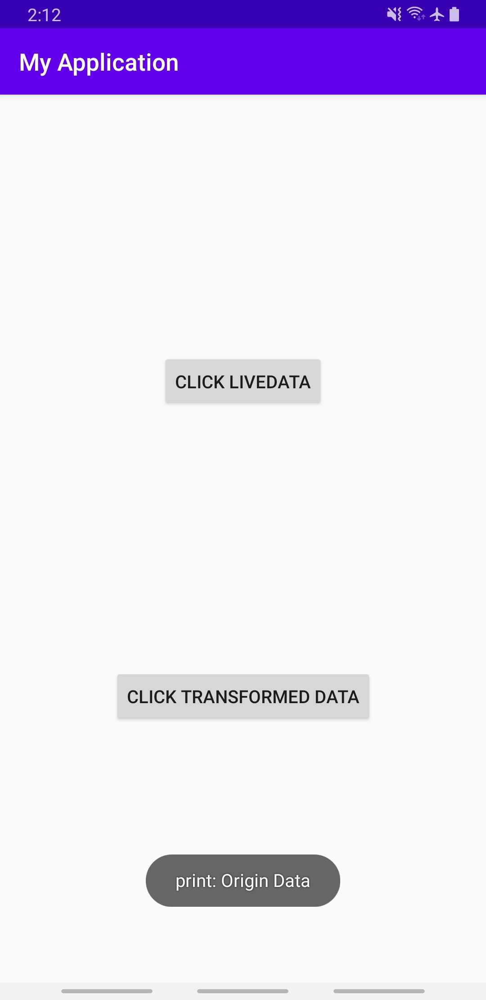
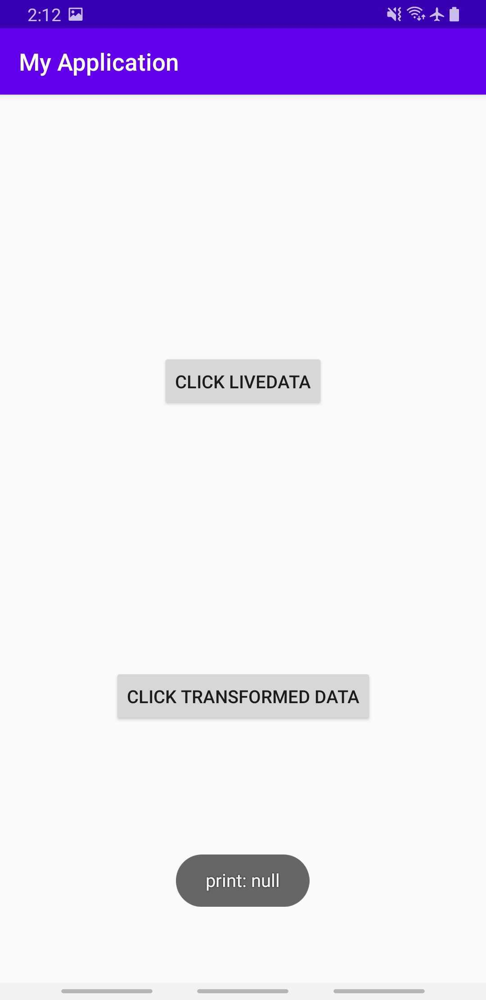

# databinding-lambda-livedata-issue
Lambda in DataBinding do not observe the livedata

```kotlin
class TestViewModel : ViewModel() {

    val liveData1 = MutableLiveData<String>().also {
        it.value = "Origin Data"
    }

    val liveData2 = Transformations.map(liveData1) {
        "Transformed Data"
    }

    fun print(context: Context, text: String?) {
        Toast.makeText(
            context,
            "print: $text",
            Toast.LENGTH_SHORT
        ).show()
    }
}
```

```
<Button
    android:id="@+id/button1"
    android:text="Click LiveData"
    android:onClick="@{() -> viewModel.print(context, viewModel.liveData1)}"
    />

<Button
    android:id="@+id/button2"
    android:text="Click Transformed Data"
    android:onClick="@{() -> viewModel.print(context, viewModel.liveData2)}"
    />
```

## When click button 1, toast "print: Origin Data" is shown



## When click button 2, toast "print: null" is shown

